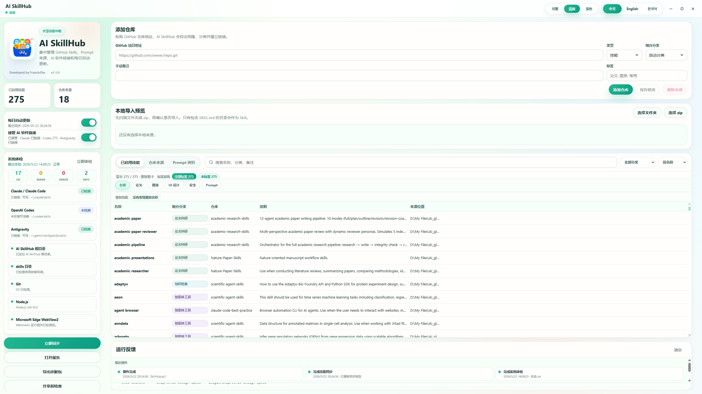

# AI SkillHub

AI SkillHub is a Windows desktop app for managing AI agent Skills in one place. It helps you collect Skills from GitHub, local folders, or zip files, then link the usable Skills into tools such as Claude Code, Codex, and Antigravity.



## Download

Recommended for normal users:

1. Open the latest release page: <https://github.com/Francis-Zxp/AI-SkillHub/releases/latest>
2. Download `AI-SkillHub-v1.1.0.zip`.
3. Unzip it to a normal folder, for example `D:\AI-SkillHub`.
4. Double-click `AI SkillHub.exe`.

If no release asset is available yet, you can still use the green `Code` button on GitHub and choose `Download ZIP`. After unzipping the repository, run `AI SkillHub.exe`.

See `CHANGELOG.md` and `docs/release-notes/v1.1.0.md` for version details.

## What It Does

- Manage GitHub Skill repositories, local Skill folders, and zip imports.
- Install only real Skills: a folder must contain `SKILL.md` before it is treated as a Skill.
- Keep Prompt/reference repositories as material instead of installing them as Skills.
- Link shared Skills into Claude Code, Codex, and Antigravity when those tools are detected.
- Skip missing AI coding tools instead of creating fake tool folders.
- Support source categories, tags, notes, search, sorting, duplicate-name hints, and recent operation history.
- Provide system checks, share checks, diagnostics export, and zip-import safety checks.
- Support Chinese, English, and Korean UI text, with multiple visual themes.

## Quick Start

1. Run `AI SkillHub.exe`.
2. Paste a GitHub repository URL, or import a local folder/zip.
3. Click `Sync Now`.
4. Turn on `Agent Links` if you want Claude Code, Codex, or Antigravity to read the shared Skills.
5. Use `System Check` or `Share Check` when sending the app to another computer.

The public package does not include anyone's personal Skills. Each user adds their own Skill repositories after the first launch.

## Requirements

- Windows 10 or Windows 11.
- Git for Windows, required for GitHub sync.
- Microsoft Edge WebView2 Runtime, usually already included on modern Windows.

Node, Python, Rust, and Visual Studio are not required for normal use.

## First Launch Behavior

On first launch, AI SkillHub creates a local config file:

```text
app/skillhub.config.json
```

This file stores your own sources, tags, notes, and switches. It is local to your computer and is not included in this public repository.

## Folder Layout

```text
AI-SkillHub/
  AI SkillHub.exe
  README.md
  使用说明.md
  app/
    assets/
    runtime/
    ui/
    SkillHub.ps1
    Manage-AgentSkillLinks.ps1
    Export-SkillHubDiagnostics.ps1
    skillhub.config.example.json
```

The app will create local working folders such as `skills/`, `app/github_sources/`, and `app/reports/` when needed.

## Common Questions

### Why are there no Skills after downloading?

The public download does not bundle personal Skills. Add a GitHub Skill repository or import a local Skill folder/zip, then sync.

### What if I only use Claude Code and do not have Codex?

That is fine. Codex is optional. AI SkillHub detects what is installed and skips missing tools.

### What if no AI coding tool is installed?

AI SkillHub will show that no linkable AI coding tool was detected. Install Claude Code, Codex, or Antigravity first, then enable agent linking again.

### Why does a Prompt repository not appear as an active Skill?

Prompt/reference material is not a callable Skill. AI SkillHub keeps it as source material instead of installing it into `skills/`.

### Is zip import safe?

AI SkillHub previews zip files before import and blocks unsafe paths that try to escape the target folder.

## Developer Notes

Current v1 stack:

- C# WinForms shell
- Microsoft WebView2
- Static HTML/CSS/JavaScript UI
- PowerShell sync/link scripts
- JSON config

Future v2 direction:

- Tauri 2
- React
- TypeScript
- Rust
- SQLite

## Author

Developed by FrancisZhu.
