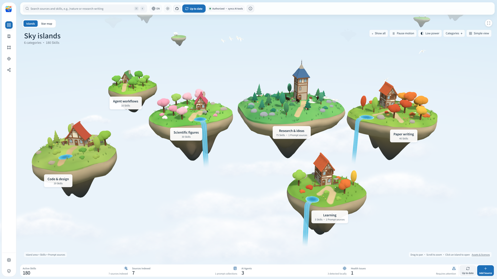
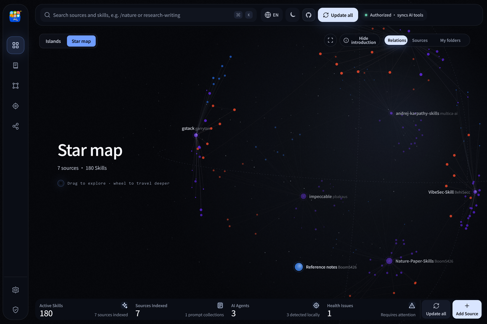

# AI SkillHub

**简体中文** · [English](README_EN.md) · [한국어](README_KO.md)

### 在一个地方，整理你的 AI Skills。

一款 Windows 桌面应用，用于收集 Skills、更新来源，并连接到你的 AI 工具。在可搜索的本地技能库中管理 GitHub 仓库、本地 Skills、Prompt 资料和 MCP 配置。

[**下载最新正式版**](https://github.com/Francis-Zxp/AI-SkillHub/releases/latest) · [更新记录](CHANGELOG.md) · [反馈问题](https://github.com/Francis-Zxp/AI-SkillHub/issues)

## 界面预览

### 天空正午 · 群岛



*每座岛代表一个分类，岛屿大小反映分类中包含的内容量。*

### 极夜 · 星图



### 关系图谱 · 沉浸视图


*截图使用英文演示技能库。三张均按 1440 × 960 普通窗口布局，以 4320 × 2880 高分辨率输出。关系图谱开启应用内的沉浸按钮，程序与桌面均未全屏。点击图片可查看原图。*

## 可以做什么

| 任务 | AI SkillHub 如何帮助你 |
| --- | --- |
| 建立技能库 | 导入 GitHub 仓库、本地文件夹、ZIP 或 `.skill` 包，也可发现受支持的本机 AI 工具目录中已有的 Skills。 |
| 找到合适的能力 | 搜索、分类、添加标签、评分和备注，管理来源与单个 Skill。用群岛浏览分类，用星图查看关系。 |
| 更新来源 | 检查上游 Git 仓库并同步新增 Skills，逐项查看已更新、已是最新、失败或跳过的来源。 |
| 连接多个 AI 工具 | 检测 Claude Code、Codex、Antigravity 等受支持的工具，将已启用 Skills 投递到选定工具。 |
| 保留相似 Skills | 每个来源有独立父入口及其子 Skills；不同作者的相似能力可以同时保留。 |
| 管理 MCP 连接 | 读取受支持宿主的配置、预览变更、应用绑定和恢复快照。Origin MCP 另有专用安装与连接检测。 |

## 三步开始

1. **安装应用**：从最新正式版下载 `AI-SkillHub-<version>-setup.exe`，也可选择 ZIP 包。
2. **添加来源**：在技能库导入来源，或在 AI 工具页面发现本机已有的 Skills。
3. **选择 AI 工具**：同步已启用的 Skills，打开来源查看使用说明。

界面支持中文、英文和韩文。可调整主题、文字大小、图标大小、动画和省电模式。

## Skills、Prompts 与 MCP

- **Skills** 包含 `SKILL.md`，描述 Agent 可以加载的能力。父入口组织同一来源下的子 Skills。
- **Prompts** 是可复用的指令或参考资料。只有 Markdown 文件的 Prompt 仓库不会因此被安装成 Skill。
- **MCP** 将 AI 客户端连接到外部服务器或应用。导入配置不代表服务器依赖已全部安装，也不代表服务已运行；受支持的集成可使用应用中的连接检测。

## 更新与数据

**来源更新**从原始仓库拉取改动。固定版本、本地修改或没有上游地址的来源可能需要处理，更新结果会逐项说明原因。你自己的备注与评分独立于上游内容保存。

**应用更新**使用签名的官方正式版安装包，可在设置中检查并安装，也可到最新正式版页面手动下载。历史版本信息集中在[更新记录](CHANGELOG.md)。

技能库、设置、评分与本地索引存放在程序目录之外：

```text
%LOCALAPPDATA%\AI SkillHub\UserData\
```

扫描时不会执行导入来源中的脚本。来源审查、诊断和可恢复快照用于在应用变更前核对内容。公开发布包不包含开发者的个人技能库。

## 开发

技术栈：**Tauri 2 · React · TypeScript · Rust · SQLite**。

当前维护的桌面工程位于 [`app-next`](app-next/README.md)，开发要求与命令见该目录的文档。父子路由规则见 [Skill Router Standard](docs/skill-router-standard.md)。

---

作者：**FrancisZhu**。
